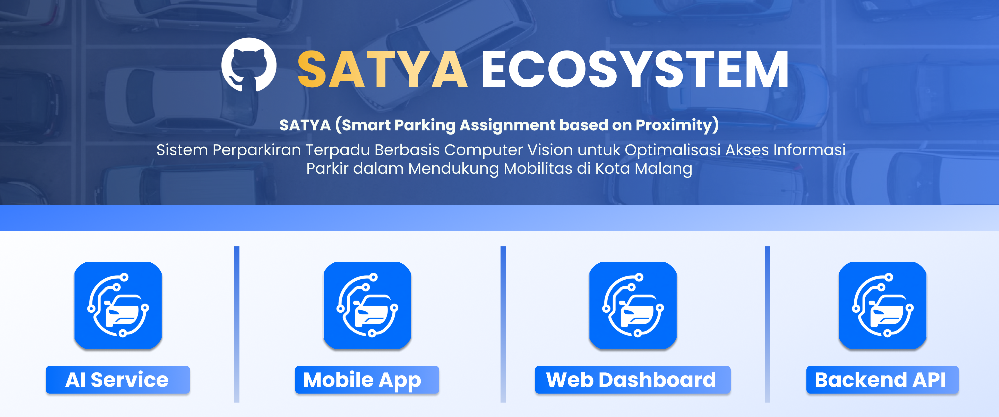

<p align="center">
  
</p>

# SATYA Ecosystem 🚗

**SATYA (Smart Parking Assignment based on Proximity)** adalah ekosistem smart parking yang dirancang untuk mendukung proses pencarian, pemesanan, validasi, dan monitoring parkir secara digital. Sistem ini mengintegrasikan aplikasi mobile, web dashboard, backend API, database, dan computer vision service untuk membantu pengguna memperoleh informasi parkir secara real-time serta membantu mitra dalam mengelola operasional parkir.

SATYA dikembangkan sebagai solusi sistem parkir cerdas yang mendukung proses **proximity-based booking**, validasi kendaraan, monitoring ketersediaan slot parkir, pengelolaan transaksi, serta deteksi pelanggaran parkir secara otomatis.

## Repository 📦

### satya-mobile-app


Aplikasi mobile berbasis Flutter yang digunakan oleh pengguna untuk melihat ketersediaan slot parkir, melakukan booking, menerima alokasi slot, mengikuti arahan menuju lokasi parkir, dan melakukan pembayaran digital.

### satya-web-dashboard


Dashboard berbasis web yang digunakan oleh admin dan mitra parkir untuk memantau operasional sistem, mengelola data mitra, melihat status slot parkir, memantau transaksi, dan memvalidasi pelanggaran.

### satya-backend-api


Backend API berbasis TypeScript yang menangani business logic utama SATYA, seperti booking parkir, validasi radius, alokasi slot, pengelolaan transaksi, validasi pelanggaran, dan komunikasi antarservice.

### satya-ai-service


Layanan computer vision berbasis Python yang digunakan untuk mendukung deteksi okupansi slot parkir, validasi kendaraan, pengenalan plat nomor, dan deteksi pelanggaran parkir secara otomatis.

## System Overview 🧩

Ekosistem SATYA terdiri dari beberapa komponen utama:

```txt
Mobile App
↓
Backend API
↓
Database

Web Dashboard
↓
Backend API
↓
Database

CCTV / Camera
↓
AI Service
↓
Backend API
↓
Database
```

Komponen utama sistem:

```txt
Mobile App      : aplikasi pengguna
Web Dashboard   : dashboard admin dan mitra
Backend API     : pusat business logic dan integrasi
AI Service      : layanan computer vision
Database        : penyimpanan data sistem
```

## Main Features ✨

### Real-Time Parking Availability

Menampilkan informasi ketersediaan slot parkir secara real-time berdasarkan data sistem dan hasil monitoring area parkir.

### Proximity-Based Booking

Mendukung proses booking parkir berdasarkan kedekatan pengguna dengan lokasi parkir untuk mengurangi risiko slot terkunci terlalu lama.

### Slot Assignment

Mengalokasikan slot parkir kepada pengguna berdasarkan kondisi ketersediaan dan aturan sistem.

### Vehicle Validation

Memvalidasi kendaraan pengguna berdasarkan data booking, lokasi, dan hasil deteksi dari computer vision service.

### Violation Detection

Mendukung deteksi dan pencatatan pelanggaran seperti no-show, wrong slot, dan unpaid transaction.

### Digital Payment

Mendukung proses pembayaran parkir secara digital dan pencatatan status pembayaran pengguna.

### Dashboard Monitoring

Menyediakan dashboard bagi admin dan mitra untuk memantau lokasi parkir, slot, transaksi, pengguna, dan pelanggaran.

## Development Workflow 🛠️

Setiap service dikembangkan pada repository terpisah agar proses pengembangan lebih terstruktur dan mudah dikelola.

```txt
satya-mobile-app      : pengembangan aplikasi mobile pengguna
satya-web-dashboard   : pengembangan dashboard admin dan mitra
satya-backend-api     : pengembangan API dan business logic
satya-ai-service      : pengembangan layanan computer vision
```

Setiap repository memiliki README masing-masing yang berisi panduan instalasi, struktur project, environment variables, dan instruksi development sesuai tech stack yang digunakan.

## Commit Convention 📝

Project ini menggunakan format commit sederhana berbasis conventional commit, dengan awalan menggunakan bahasa Inggris dan deskripsi aktivitas menggunakan bahasa Indonesia.

Format commit:

```txt
<type>: <aktivitas dalam bahasa Indonesia>
```

Contoh commit:

```txt
chore: inisialisasi proyek
feat: tambah halaman login
feat: tambah endpoint booking parkir
fix: perbaiki validasi status transaksi
refactor: rapikan struktur folder service
style: sesuaikan tampilan sidebar
docs: tambah panduan instalasi lokal
```

Daftar type yang digunakan:

```txt
feat     : penambahan fitur baru
fix      : perbaikan bug
chore    : konfigurasi, setup, dependency, atau pekerjaan non-fitur
refactor : perapian kode tanpa mengubah fitur
style    : perubahan tampilan, styling, formatting, atau format response
docs     : perubahan dokumentasi
```

## Development Notes ⚠️

Pastikan file konfigurasi sensitif tidak di-push ke repository.

File yang tidak boleh di-push:

```txt
.env
.env.*
API key
service role key
credential file
model file
dataset
```

File model AI dan dataset sebaiknya disimpan menggunakan penyimpanan terpisah karena ukuran file dapat menjadi besar dan tidak ideal untuk disimpan langsung di GitHub.
